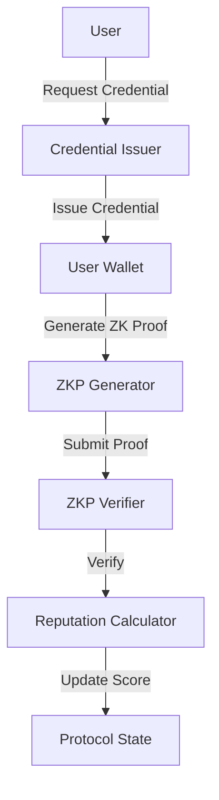

# Pixel Protocol


<p align="center">
  <strong>Decentralized Reputation Infrastructure for Web3</strong>
</p>

<p align="center">
  <a href="https://docs.pixelprotocol.com">Documentation</a> •
  <a href="#quick-start">Quick Start</a> •
  <a href="#use-cases">Use Cases</a> •
  <a href="#sdk">SDK</a> •
  <a href="https://discord.gg/pixelprotocol">Discord</a>
</p>

## Overview

Pixel Protocol is a decentralized reputation infrastructure that enables privacy-preserving credential verification and reputation scoring in Web3. Built on zero-knowledge proofs, the protocol allows users to prove their credentials and reputation without revealing sensitive information.


### Key Features

- 🔐 **Privacy-First**: Zero-knowledge proofs for credential verification
- 🏗️ **Modular Design**: Flexible architecture supporting various reputation models
- 🔄 **Composable**: Easy integration with existing Web3 applications
- 🌐 **Cross-Chain**: Support for multiple blockchain networks
- 📱 **SDK Support**: Comprehensive SDK for seamless integration
- 🤝 **Permissionless**: Open protocol for credential issuers and verifiers

## Use Cases

### 1. DeFi Risk Assessment

- Credit scoring for undercollateralized lending
- Risk profiling for insurance protocols
- Trading reputation for permissioned DEXs

### 2. DAO Governance

- Sybil-resistant voting mechanisms
- Reputation-based proposal submission
- Contributor reputation tracking

### 3. Web3 Social Networks

- Verified social credentials
- Spam prevention
- Content creator reputation

### 4. Gaming & NFTs

- Player reputation systems
- Achievement verification
- NFT creator credentials

### 5. Professional Networking

- Verified work experience
- Skill certifications
- Professional reputation scoring

## Architecture

### Smart Contracts

1. **Credential Issuer**

   - Issues verifiable credentials
   - Manages credential lifecycle
   - Handles revocation

2. **Reputation Calculator**

   - Computes reputation scores
   - Implements scoring models
   - Manages score updates

3. **ZKP Verifier**
   - Verifies zero-knowledge proofs
   - Handles batch verification
   - Manages proving keys

### Protocol Flow



## Quick Start

### 1. Install SDK

```bash
npm install @pixel-protocol/sdk
```

### 2. Initialize Protocol

```typescript
import { PixelProtocol } from "@pixel-protocol/sdk";

const protocol = new PixelProtocol({
  rpcUrl: "https://rpc-quicknode-holesky.morphl2.io",
  chainId: 2810, // Morph Holesky Testnet
  credentialIssuerAddress: "YOUR_CONTRACT_ADDRESS",
  reputationCalculatorAddress: "YOUR_CONTRACT_ADDRESS",
  zkpVerifierAddress: "YOUR_CONTRACT_ADDRESS",
  subgraphUrl:
    "https://api.thegraph.com/subgraphs/name/pixelprotocol/morph-holesky",
});
```

### 3. Issue Credentials

```typescript
// As a credential issuer
const credential = await protocol.issueCredential({
  recipient: "0x...",
  type: "PAYMENT_HISTORY",
  data: {
    score: 95,
    transactions: 150,
    totalValue: "1000000000000000000",
  },
});
```

### 4. Verify Credentials

```typescript
// As a credential holder
const proof = await protocol.generateProof({
  credentialId: "0x...",
  claim: "score > 90",
});

// As a verifier
const isValid = await protocol.verifyProof(proof);
```

## SDK Documentation

The Pixel Protocol SDK provides a comprehensive interface for interacting with the protocol. [Full SDK Documentation](pixel-sdk/README.md)

### Core Components

1. **Credential Management**

   - Issue credentials
   - Verify credentials
   - Manage credential lifecycle

2. **Reputation Scoring**

   - Calculate reputation scores
   - Query reputation data
   - Update scoring models

3. **Zero-Knowledge Proofs**

   - Generate proofs
   - Verify proofs
   - Batch operations

4. **Wallet Integration**
   - Connect wallets
   - Sign messages
   - Manage transactions

## Deployment

### Mainnet (Coming Soon)

- Network: Ethereum
- Deployment Date: Q4 2025

### Testnet

- Network: Morph Holesky Testnet
- Chain ID: 2810
- RPC URL: https://rpc-quicknode-holesky.morphl2.io
- Explorer: https://explorer-holesky.morphl2.io

## Development

### Prerequisites

- Node.js v18+
- Yarn or npm
- Hardhat

### Setup

```bash
# Clone repository
git clone https://github.com/ayaanoski/pixel-protocol.git
cd pixel-protocol

# Install dependencies
npm install

# Build contracts
npm run build

# Run tests
npm test
```

## Security

### Audits

- [Audit Report 1](docs/audits/audit1.pdf) - Date: TBD
- [Audit Report 2](docs/audits/audit2.pdf) - Date: TBD

### Bug Bounty

Visit our [Bug Bounty Program](https://hackenproof.com/pixel-protocol) for details.

## Community & Support

- [Discord](https://discord.gg/pixelprotocol)
- [Forum](https://forum.pixelprotocol.com)
- [Documentation](https://docs.pixelprotocol.com)
- [Twitter](https://twitter.com/PixelProtocol)
- [Blog](https://blog.pixelprotocol.com)

## Contributing

We welcome contributions! Please read our [Contributing Guidelines](CONTRIBUTING.md) first.

### Development Process

1. Fork the repository
2. Create your feature branch
3. Commit your changes
4. Push to the branch
5. Create a Pull Request

## License

This project is licensed under the MIT License - see the [LICENSE](LICENSE) file for details.

## Team

- **Founders**
  - [Name 1](https://github.com/username1) - Smart Contract Development
  - [Name 2](https://github.com/username2) - Protocol Design
  - [Name 3](https://github.com/username3) - SDK Development

## Roadmap

### Q3 2025

- ✅ Protocol Design
- ✅ Smart Contract Development
- ✅ SDK Beta Release
- ✅ Testnet Launch

### Q4 2025

- 🔄 Security Audits
- 🔄 Mainnet Launch
- 🔄 Partnership Announcements
- 🔄 Governance Implementation

### Q1 2026

- 📝 Cross-Chain Integration
- 📝 Advanced Reputation Models
- 📝 DAO Formation
- 📝 Token Launch

## Acknowledgments

Special thanks to:

- Our early contributors
- Security auditors
- Community members
- Research partners
